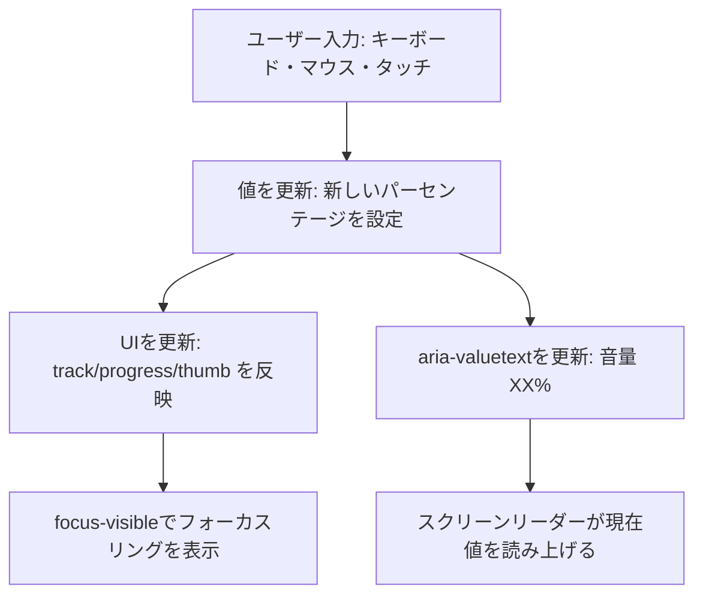

Material Design 3 のアクセシビリティを参考に、スライダーコンポーネントを実装したので、
その知見をまとめます。

## 前提

- React 19
- TypeScript
- TailwindCSS

## Material Design とは

[Material Design](https://m3.material.io/) とは、Googleによるオープンソースのデザインシステムです。

> Material Design 3 is Google’s open-source design system for building beautiful, usable products.

多くのコンポーネントに関するドキュメントが含まれており、ほとんどのコンポーネントには

- Overview（概要）
- Specs（仕様）
- Guidelines（ガイドライン）
- Accessibility（アクセシビリティ）

が記述されています。

今回は、アクセシビリティに注目してスライダーを設計・実装していきます。

## MD3におけるスライダー

MD3 のアクセシビリティでは、

- Use cases
- Interaction & styles
- Keyboard navigation
- Labeling elements

を含む内容が記述されています。

スライダーで記述されている内容をざっくりまとめます。

### Interaction & styles

- 操作フィードバック
- フォーカスの可視化（Focus Ring）

### Color contrast

- 非アクティブトラック背景のコントラスト比が3:1

### Keyboard navigation

- キーボード操作の網羅性（Arrow/Jump keys）

### Labeling elements

- 役割と名前付け（`role`/`aria-*`）
- タッチ/クリック領域の十分なサイズ

参考: [MD3 Sliders Accessibility](https://m3.material.io/components/sliders/accessibility)

その他、サイズや配置などはSpecsやGuidelinesに書いてあります。

## スライダーのイベントフロー

以下に、スライダーのイベントフローをまとめます。



これをもとに、MD3の内容を設計・実装していきます。

## Interaction & styles（操作とスタイル）

### 設計（Interaction & styles）

- 視覚レイヤーは「track」「progress」「thumb」を分離
- 値に応じて `progress` の幅と `thumb` の位置を更新
- フォーカス時はリングを強調（`focus-visible`）し、ホバー/アクティブ時にスタイル変化

### 実装（Interaction & styles）

```tsx title="AccessibleSliderDemo.tsx"
import { useCallback, useRef, useState } from 'react';

export function AccessibleSliderDemo() {
  const [value, setValue] = useState(50);
  const inputRef = useRef<HTMLInputElement>(null);

  // Keyboard navigation: Arrow/Home/End/Page 系の挙動を実装（MD3: Keyboard navigation）
  // - Arrow: ±1%（Shift併用で±10%）
  // - PageUp/Down: ±10%
  // - Home/End: 0% / 100%
  const onKeyDown = useCallback((e: React.KeyboardEvent<HTMLInputElement>) => {
    const step = e.shiftKey ? 10 : 1;
    const clamp = (n: number) => Math.max(0, Math.min(100, n));
    switch (e.key) {
      case 'ArrowUp':
      case 'ArrowRight':
        e.preventDefault(); // スクロールとの競合を防ぐ
        setValue(v => clamp(v + step));
        return;
      case 'ArrowDown':
      case 'ArrowLeft':
        e.preventDefault(); // スクロールとの競合を防ぐ
        setValue(v => clamp(v - step));
        return;
      case 'Home':
        e.preventDefault();
        setValue(0);
        return;
      case 'End':
        e.preventDefault();
        setValue(100);
        return;
      case 'PageUp':
        e.preventDefault();
        setValue(v => clamp(v + 10));
        return;
      case 'PageDown':
        e.preventDefault();
        setValue(v => clamp(v - 10));
        return;
    }
    if (inputRef.current) inputRef.current.value = String(value);
  }, [value]);

  return (
    // Labeling elements: コントロール群のラベル（必要に応じて aria-labelledby に置換）
    <div className="relative h-6 w-64" role="group" aria-label="音量コントロール">
      {/* 非アクティブ track ← Interaction & styles / Color contrast: 3:1 を満たすコントラスト */}
      <div className="absolute inset-0 rounded-full bg-slate-200 dark:bg-slate-700" />
      {/* progress ← Interaction & styles: 値に応じて幅を更新 */}
      <div
        className="absolute inset-y-0 rounded-full bg-blue-500 dark:bg-blue-400"
        style={{ width: `${value}%` }}
      />
      {/* thumb ← Interaction & styles: 位置合わせ（calc(% - ハンドル半分の幅)） */}
      <div
        className="absolute top-0 bottom-0 w-0.5 bg-slate-800 dark:bg-slate-100"
        style={{ left: `calc(${value}% - 1px)` }}
      />
      {/* 入力本体（透明）← Labeling elements: aria-* / Focus visible: focus-visible でリング表示 */}
      <input
        ref={inputRef}
        type="range"
        min="0"
        max="100"
        step="1"
        value={value}
        onChange={(e) => setValue(Number(e.target.value))}
        onKeyDown={onKeyDown}
        aria-label="音量調整" // Labeling elements: 入力の名前
        aria-valuetext={`音量 ${value}%`} // Labeling elements: 値の自然言語化
        className={`
          absolute inset-0 opacity-0 cursor-pointer
          focus-visible:outline-none
          focus-visible:ring-2 focus-visible:ring-ring
          focus-visible:ring-offset-2 focus-visible:ring-offset-background
        `}
      />
      {/* SR向け補足 ← Labeling elements */}
      <span className="sr-only">音量: {value}%</span>
    </div>
  );
}
```

デザイン体系を導入する場合は、色/影/形状のトークンを定義して一貫性を担保します。

## Keyboard navigation（キーボード操作）

### 設計（Keyboard navigation）

MD3は「小刻み（Arrow）」と「大きく（PageUp/Down）」、「端へジャンプ（Home/End）」を要求します。

- Arrow: 1%（Shiftで10%）の増減
- PageUp/Down: 10%の増減
- Home/End: 0%/100% へジャンプ
- `preventDefault()` で画面スクロール等と競合させない

### 実装（Keyboard navigation）

```tsx title="onKeyDown.tsx"
// onKeyDownハンドラ（ローカルstate: value[0..100] を想定）
const onKeyDown = (e: React.KeyboardEvent<HTMLInputElement>) => {
  const step = e.shiftKey ? 10 : 1;
  const clamp = (n: number) => Math.max(0, Math.min(100, n));
  switch (e.key) {
    case 'ArrowUp':
    case 'ArrowRight':
      e.preventDefault();
      setValue(v => clamp(v + step));
      return;
    case 'ArrowDown':
    case 'ArrowLeft':
      e.preventDefault();
      setValue(v => clamp(v - step));
      return;
    case 'Home':
      e.preventDefault();
      setValue(0);
      return;
    case 'End':
      e.preventDefault();
      setValue(100);
      return;
    case 'PageUp':
      e.preventDefault();
      setValue(v => clamp(v + 10));
      return;
    case 'PageDown':
      e.preventDefault();
      setValue(v => clamp(v - 10));
      return;
  }
};
```

## Labeling elements（ラベル付け）

### 設計（Labeling elements）

スライダーには「名前（ラベル）」「役割（range入力）」「値（数値や単位）」が必要です。ラベルは可視テキスト推奨で、`aria-labelledby` で結び付け、`aria-valuetext` で自然言語の値を提示します。複数コントロールのグループには `role="group"` とグループラベルを与え、必要に応じて `sr-only` で補助テキストを追加します。

### 実装（Labeling elements）

```tsx title="LabelingExample.tsx"
<label id="slider-label">音量</label>
<div role="group" aria-labelledby="slider-label">
<input
  type="range"
  min="0"
  max="100"
  step="1"
  value={value}
  onChange={(e) => setValue(Number(e.target.value))}
  onKeyDown={onKeyDown}
  aria-valuetext={`音量 ${value}%`}
  /*
    視覚要素（track/progress/thumb）は別DOMで表現。
    input自体は透明だがフォーカスは当たる。focus-visibleでリング表示を担保。
  */
  className={`
    absolute w-full h-6 opacity-0 cursor-pointer
    focus-visible:outline-none
    focus-visible:ring-2 focus-visible:ring-ring
    focus-visible:ring-offset-2 focus-visible:ring-offset-background
  `}
  title={`音量: ${value}%`}
/>
<!-- トラックやプログレス等の視覚部品は別DOMで作る -->
</div>
```

- 視覚的なトラック/ハンドルはカスタムDOMで表現し、実際の操作は `input[type="range"]` が担います。
- `opacity: 0` でもフォーカス可能で、Focus Ringは `focus-visible` で確保します。

## Color contrast（色とコントラスト）

- 非アクティブトラック背景のコントラスト比が3:1（MD3推奨）
- 色覚多様性に配慮し、`track` と `progress` の色差・明度差を十分に確保
- フォーカスリングは背景と十分なコントラストで視認可能に

---

## まとめ: Use cases

以下は代表的なユースケースごとの最小実装テンプレートです。

```tsx title="MinimalAccessibleSlider.tsx"
// MinimalAccessibleSlider.tsx
import { useCallback, useRef, useState } from 'react';

export default function MinimalAccessibleSlider() {
  const [value, setValue] = useState(50);
  const inputRef = useRef<HTMLInputElement>(null);

  const onKeyDown = useCallback((e: React.KeyboardEvent<HTMLInputElement>) => {
    // Shiftで粗く、通常は細かく（Keyboard navigationの設計に準拠）
    const step = e.shiftKey ? 10 : 1;
    const v = value;
    const clamp = (n: number) => Math.max(0, Math.min(100, n));
    switch (e.key) {
      case 'ArrowUp':
      case 'ArrowRight':
        e.preventDefault();
        setValue(clamp(v + step));
        break;
      case 'ArrowDown':
      case 'ArrowLeft':
        e.preventDefault();
        setValue(clamp(v - step));
        break;
      case 'Home':
        e.preventDefault();
        setValue(0);
        break;
      case 'End':
        e.preventDefault();
        setValue(100);
        break;
      case 'PageUp':
        e.preventDefault();
        setValue(clamp(v + 10));
        break;
      case 'PageDown':
        e.preventDefault();
        setValue(clamp(v - 10));
        break;
    }
    // キーボード操作時にUIと値の同期を担保
    if (inputRef.current) inputRef.current.value = String(value);
  }, [value]);

  return (
    <div role="group" aria-label="音量コントロール" style={{ width: 160 }}>
      <div style={{ position: 'relative', height: 24 }}>
        {/* Interaction & styles: 視覚レイヤー（安全なカスタムDOM）。色やサイズは自由に変更可能 */}
        <div style={{ position: 'absolute', inset: 0, background: '#E5E7EB', borderRadius: 9999 }} />
        <div style={{ position: 'absolute', inset: 0, width: `${value}%`, background: '#3B82F6', borderRadius: 9999 }} />
        <div style={{ position: 'absolute', left: `calc(${value}% - 1px)`, top: 0, bottom: 0, width: 2, background: '#1F2937' }} />
        {/* 操作レイヤー */}
        <input
          ref={inputRef}
          type="range"
          min="0"
          max="100"
          step="1"
          defaultValue={value}
          onChange={(e) => setValue(Number(e.target.value))}
          onKeyDown={onKeyDown}
          {/* Labeling elements: 可視ラベルを推奨するが、簡易例ではaria-labelを使用 */}
          aria-label="音量調整"
          aria-valuetext={`音量 ${value}%`}
          style={{ position: 'absolute', inset: 0, opacity: 0 }}
        />
      </div>
      {/* Labeling elements: スクリーンリーダー補助テキスト */}
      <span className="sr-only">音量: {value}%</span>
    </div>
  );
}
```

## E2Eテスト（Playwright）

### 方針

- Keyboard navigation: Arrow/Home/End/Page 系の挙動と `aria-valuetext` の更新
- Labeling elements: 可視ラベルとスライダーの関連付け（`aria-labelledby`）
- Interaction & styles: 値変更に伴うUI同期（DOM反映がある場合）
- （任意）Color contrast: ビジュアル回帰テストで劣化が無いことを確認

### シナリオ1: Keyboard navigation を網羅

```ts title="Slider.keyboard.e2e.ts"
import { test, expect } from '@playwright/test';

test('keyboard navigation updates aria-valuetext', async ({ page }) => {
  await page.goto('/');
  const slider = page.getByRole('slider', { name: /音量/ });
  await slider.focus();

  // ArrowRight: +1%（概念テストとして値が増えることのみ確認）
  await page.keyboard.press('ArrowRight');
  await expect(slider).toHaveAttribute('aria-valuetext', /音量\s\d+%/);

  // Home → 0%、End → 100%
  await page.keyboard.press('Home');
  await expect(slider).toHaveAttribute('aria-valuetext', '音量 0%');
  await page.keyboard.press('End');
  await expect(slider).toHaveAttribute('aria-valuetext', '音量 100%');

  // PageDown: -10%（100% → 90% 以上の挙動を満たす）
  await page.keyboard.press('PageDown');
  await expect(slider).toHaveAttribute('aria-valuetext', /音量\s(9\d|8\d)%/);
});
```

### シナリオ2: Labeling elements の関連付け

```ts title="Slider.labeling.e2e.ts"
import { test, expect } from '@playwright/test';

test('slider is labelled by visible label', async ({ page }) => {
  await page.goto('/');
  const label = page.getByText('音量');
  const slider = page.getByRole('slider');
  // アクセシブル名前に「音量」が含まれる（aria-labelledby or aria-labelで提供）
  await expect(slider).toHaveAccessibleName(/音量/);
});
```

### シナリオ3: Interaction & styles のUI同期（任意）

実装で `data-testid` を付けられるなら、progress/sliderのDOM同期も検証可能です。

```ts title="Slider.ui-sync.e2e.ts"
import { test, expect } from '@playwright/test';

test('progress width reflects current value (if exposed)', async ({ page }) => {
  await page.goto('/');
  const slider = page.getByRole('slider', { name: /音量/ });
  const progress = page.getByTestId('slider-progress'); // 実装側で付与した場合
  await slider.focus();
  await page.keyboard.press('Home'); // 0%
  await expect(progress).toHaveCSS('width', '0%');
  await page.keyboard.press('End'); // 100%
  // 100% 等の厳密比較が難しい場合は部分一致に緩和
  const width = await progress.evaluate((el) => (el as HTMLElement).style.width);
  expect(width).toContain('%');
});
```

### シナリオ4（任意）: Pointer/Touch 操作

```ts title="Slider.pointer.e2e.ts"
import { test, expect } from '@playwright/test';

test('pointer drag updates value', async ({ page, browserName }) => {
  await page.goto('/');
  const slider = page.getByRole('slider', { name: /音量/ });
  const box = await slider.boundingBox();
  if (!box) test.skip(true, 'no box');
  // 真ん中へドラッグ→値が変わることのみ確認
  await page.mouse.move(box!.x + 2, box!.y + box!.height / 2);
  await page.mouse.down();
  await page.mouse.move(box!.x + box!.width / 2, box!.y + box!.height / 2);
  await page.mouse.up();
  await expect(slider).toHaveAttribute('aria-valuetext', /音量\s\d+%/);
});
```

## まとめ

MD3のガイドラインを参考にすることで、迷うことなくアクセシビリティに配慮したコンポーネント設計を行うことができます。
スライダーコンポーネントでは、主に以下に配慮しました。

- [ ] Tabでスライダーにフォーカスでき、フォーカスリングが表示される
- [ ] Arrow/Home/End/Page系のキーで値が正しく変わる
- [ ] アクセシブル名前と `aria-valuetext` が期待どおりに読み上げられる
- [ ] track/progress/thumb が現在値に同期する（視覚上のズレがない）
- [ ] 非アクティブtrackはコントラスト比3:1以上、リングも十分なコントラスト

ほかのコンポーネントでもアクセシビリティのガイドラインを読むことができます！ぜひ参考にしてみてください。

---

*Accessibility fosters a more diverse world! ✨*
