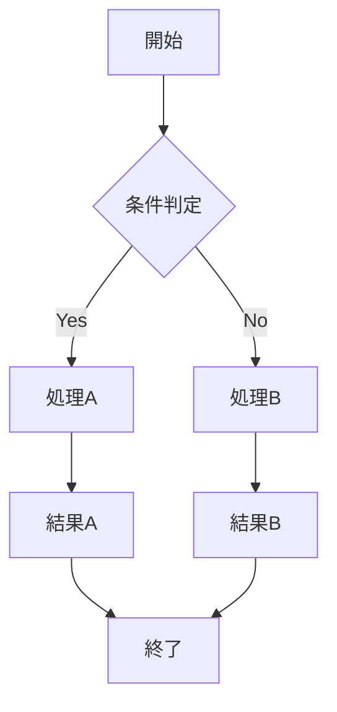
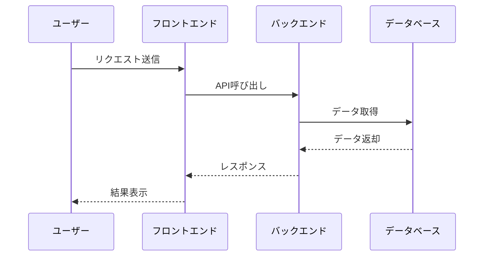

※このテスト記事はClaudeをもとに作成しました。

この記事では、このブログで使用できる様々なMarkdown要素をまとめています。

記事の下にコメントを残すことができるので、自由に試してみてください。

## 見出し

### H3見出し

#### H4見出し

##### H5見出し

###### H6見出し

## テキストスタイル

これは通常のテキストです。**太字**、*斜体*、`インラインコード`、~~取り消し線~~などが使用できます。

### リンクテスト

- [外部リンク](https://nextjs.org/)
- [内部リンク](/blog)

このブログでは[Next.js](https://nextjs.org/)を使用しており、
[Shiki](https://shiki.style/)によるシンタックスハイライトや[Tailwind CSS](https://tailwindcss.com/)によるスタイリングを採用しています。

## リスト

### 順序なしリスト

- 項目1
- 項目2
  - ネストされた項目1
  - ネストされた項目2
- 項目3

### 順序付きリスト

1. 最初の項目
2. 2番目の項目
   1. ネストされた項目A
   2. ネストされた項目B
3. 3番目の項目

## 引用

> これは引用文です。重要な情報や名言を強調するときに使用します。
>
> 複数行の引用も可能です。

## コードブロック（Shikiテスト）

### JavaScript

```javascript title="greet.js"
// シンプルな関数の例
function greetUser(name) {
  return `Hello, ${name}!`;
}

// ES6 アロー関数
const multiply = (a, b) => a * b;
```

### TypeScript

```typescript title="user-service.ts"
interface User {
  id: number;
  name: string;
  email: string;
  isActive: boolean;
}

class UserService {
  private users: User[] = [];
  
  constructor(private apiKey: string) {}
  
  async fetchUser(id: number): Promise<User | null> {
    try {
      const response = await fetch(`/api/users/${id}`, {
        headers: {
          'Authorization': `Bearer ${this.apiKey}`
        }
      });
      
      return response.ok ? await response.json() : null;
    } catch (error) {
      console.error('Error fetching user:', error);
      return null;
    }
  }
}
```

## テーブル

| 技術 | 説明 | 使用例 |
|------|------|--------|
| React | UIライブラリ | コンポーネント作成 |
| Next.js | Reactフレームワーク | Webアプリケーション |
| TypeScript | 型安全なJavaScript | 大規模開発 |
| Tailwind CSS | ユーティリティファーストCSS | スタイリング |

## チェックリスト

- [x] MDXレンダリングの実装
- [x] シンタックスハイライト（Shiki）
- [x] レスポンシブデザイン
- [x] ダークモード対応
- [x] Mermaid図表サポート
- [x] 数式レンダリング
- [ ] 検索機能

## 画像レンダリングテスト

### 内部画像のテスト

<Image 
  src="/assets/images/test.jpg" 
  alt="テスト画像" 
  width={600} 
  height={400}
/>

### カスタムコンポーネントのテスト

<div className="bg-gradient-to-r from-blue-100 to-purple-100 border border-blue-300 rounded-lg p-6 my-6">
  <h3 className="text-blue-800 font-semibold mb-3">MDXカスタムボックス</h3>
  <p className="text-blue-700 mb-4">これはMDX内で直接記述されたJSXコンポーネントです。Tailwind CSSのクラスを使用してスタイリングされています。</p>
  <div className="flex gap-2">
    <span className="px-3 py-1 bg-blue-200 text-blue-800 rounded-full text-sm">MDX</span>
    <span className="px-3 py-1 bg-purple-200 text-purple-800 rounded-full text-sm">JSX</span>
    <span className="px-3 py-1 bg-green-200 text-green-800 rounded-full text-sm">React</span>
  </div>
</div>

## Mermaid図表のテスト

### フローチャート



### シーケンス図



## 数式レンダリングのテスト

### インライン数式

オイラーの公式は $e^{i\pi} + 1 = 0$ です。

二次方程式の解の公式は $x = \frac{-b \pm \sqrt{b^2 - 4ac}}{2a}$ です。

複素数 $z = a + bi$ の絶対値は $|z| = \sqrt{a^2 + b^2}$ です。

### ブロック数式

#### 積分の例

$$\int_{-\infty}^{\infty} e^{-x^2} dx = \sqrt{\pi}$$

#### 行列の例

$$\begin{pmatrix} a & b \\ c & d \end{pmatrix} \begin{pmatrix} x \\ y \end{pmatrix} = \begin{pmatrix} ax + by \\ cx + dy \end{pmatrix}$$

#### 連立方程式の例

$$\begin{cases} x + y = 10 \\ 2x - y = 5 \end{cases}$$

## MDX機能の統合

この記事では、従来のMarkdown記法に加えて、MDXの新機能もテストできます：

### MDXの特徴

1. **JSXコンポーネント埋め込み** - Reactコンポーネントを直接記述
2. **Next.js Image最適化** - 画像の自動最適化とレスポンシブ対応
3. **カスタムスタイリング** - Tailwind CSSクラスの直接使用
4. **動的コンテンツ** - インラインスタイルや条件分岐
5. **Mermaid図表** - フローチャート、シーケンス図、ガントチャート等

### 技術スタック

- **MDX処理**: unified + remark/rehype パイプライン
- **シンタックスハイライト**: Shiki (VS Code同等)
- **スタイリング**: Tailwind CSS
- **画像最適化**: Next.js Image コンポーネント
- **図表レンダリング**: Mermaid.js

## 最後に

このテストページでは、従来のMarkdown記法とMDXの新機能の両方を確認できました。MDXにより、より豊富でインタラクティブなブログ記事を作成できるようになりました。

### 実装完了項目

- [x] MDXレンダリングの実装
- [x] JSXコンポーネントの埋め込み
- [x] Next.js Imageコンポーネントの最適化
- [x] シンタックスハイライト（Shiki）
- [x] レスポンシブデザイン
- [x] ダークモード対応
- [x] カスタムスタイリング
- [x] Mermaid図表サポート
- [x] 数式レンダリング
- [x] 検索機能

---

MDX + Markdown + Math testing completed! ✨
