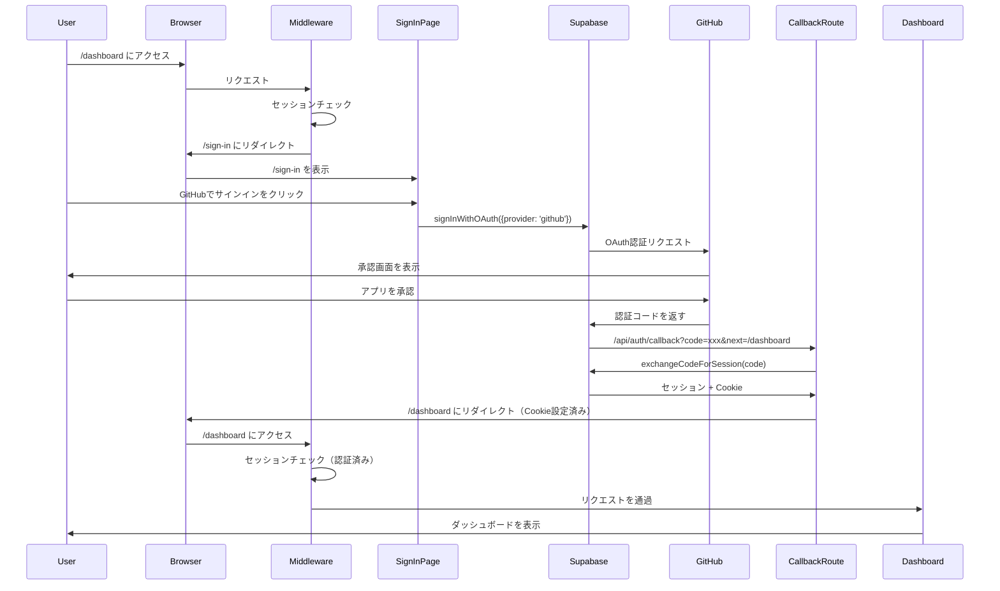

# アーキテクチャドキュメント

## 認証フロー

### 概要

このアプリケーションは Supabase Auth を使用した GitHub OAuth 認証を実装しています。

### 認証の流れ



### ディレクトリ構造

```
src/
├── app/
│   ├── api/
│   │   └── auth/
│   │       └── callback/
│   │           └── route.ts          # OAuth callback handler
│   └── [locale]/
│       ├── (auth)/
│       │   ├── (center)/
│       │   │   └── sign-in/
│       │   │       └── page.tsx      # サインインページ
│       │   └── dashboard/            # 認証が必要なページ
│       │       ├── page.tsx
│       │       └── blog/
│       │           ├── page.tsx
│       │           └── ...
│       └── (general)/               # 一般公開ページ
│           └── ...
├── components/
│   ├── auth/
│   │   ├── SupabaseSignIn.tsx      # サインインコンポーネント
│   │   ├── SupabaseSignUp.tsx
│   │   └── SupabaseUserProfile.tsx
│   └── dashboard/
│       └── DashboardClient.tsx      # ダッシュボードクライアント
├── shared/
│   ├── hooks/
│   │   └── useAuth.ts               # クライアント認証フック
│   └── libs/
│       ├── auth-server.ts           # サーバー認証ユーティリティ
│       ├── supabase-browser.ts      # ブラウザ用Supabaseクライアント
│       └── supabase-server.ts       # サーバー用Supabaseクライアント
└── middleware.ts                    # 認証ミドルウェア
```

### 認証の実装

#### 1. Middleware (`src/middleware.ts`)

- すべてのリクエストをインターセプト
- 保護されたルート (`/dashboard/**`) へのアクセスをチェック
- 未認証ユーザーを `/sign-in` にリダイレクト
- OAuth callback パス (`/api/auth/callback`) は保護対象から除外

```typescript
const isProtectedRoute = (pathname: string): boolean => {
  // 認証不要のパスを除外
  const publicPatterns = [
    /^\/api\/auth\/callback$/,
  ];
  
  if (publicPatterns.some((re) => re.test(pathname))) {
    return false;
  }
  
  // /dashboard は認証必須
  const protectedPatterns = [
    /^\/dashboard(\/.+)?$/,
    /^\/[a-z]{2}\/dashboard(\/.+)?$/,
  ];
  return protectedPatterns.some((re) => re.test(pathname));
};
```

#### 2. サインインページ (`src/app/[locale]/(auth)/(center)/sign-in/page.tsx`)

- サーバーコンポーネント
- 既にログイン済みの場合は `/dashboard` にリダイレクト
- `SupabaseSignIn` クライアントコンポーネントをレンダリング

```typescript
export default async function SignInPage(props: ISignInPageProps) {
  const { locale } = await props.params;
  setRequestLocale(locale);

  // 既にログイン済みならサーバーで即リダイレクト
  const { userId } = await auth();
  if (userId) {
    redirect(`/${locale}/dashboard`);
  }

  return <SupabaseSignIn />;
}
```

#### 3. OAuth Callback (`src/app/api/auth/callback/route.ts`)

- 認証コードをセッションに交換
- Cookie を設定
- 指定された URL にリダイレクト

```typescript
export async function GET(request: NextRequest) {
  const code = requestUrl.searchParams.get('code')
  const next = requestUrl.searchParams.get('next') || '/dashboard'
  
  // Cookie を設定できるようにレスポンスを先に作成
  const response = NextResponse.redirect(new URL(next, requestUrl.origin))
  
  const supabase = createServerClient(
    supabaseUrl,
    supabaseAnonKey,
    {
      cookies: {
        getAll() { return request.cookies.getAll() },
        setAll(cookiesToSet) {
          cookiesToSet.forEach(({ name, value, options }) => {
            response.cookies.set(name, value, options)
          })
        },
      },
    }
  )

  // コードをセッションに交換
  const { data } = await supabase.auth.exchangeCodeForSession(code)
  
  return response
}
```

#### 4. サーバーサイド認証 (`src/shared/libs/auth-server.ts`)

**セキュリティ重要事項**: `getSession()` ではなく `getUser()` を使用

```typescript
export async function auth(): Promise<{ userId: string | null }> {
  const supabase = createServerClient(...)
  
  // ⚠️ getSession() は Cookie から直接読み取るため安全でない
  // ✅ getUser() はサーバーで認証を検証するため安全
  const { data: { user }, error } = await supabase.auth.getUser()
  
  return { userId: user?.id ?? null }
}
```

### Server Component vs Client Component の使い分け

#### Server Component を使用する場合

- **ページコンポーネント** (`page.tsx`)
- **認証チェック**が必要な場合
- **データ取得** (Server Actions, Database queries)
- **環境変数**へのアクセス

**例**: Dashboard ページ

```typescript
// src/app/[locale]/(auth)/dashboard/page.tsx
export default async function Dashboard(props: {
  params: Promise<{ locale: string }>;
}) {
  const { locale } = await props.params;
  
  // サーバーサイドでユーザー情報を取得
  const user = await getCurrentUser();
  
  if (!user) {
    redirect(`/${locale}/sign-in`);
  }

  // クライアントコンポーネントに props として渡す
  return <DashboardClient initialUser={user} />
}
```

#### Client Component を使用する場合

- **インタラクティブな UI** (ボタン、フォーム)
- **ブラウザ API** の使用 (`window`, `localStorage`)
- **useState**, **useEffect** などのフック
- **イベントハンドラ** (`onClick`, `onChange`)

**例**: サインインボタン

```typescript
// src/components/auth/SupabaseSignIn.tsx
'use client'

export function SupabaseSignIn() {
  const [error, setError] = useState<string | null>(null)
  
  const handleGitHubSignIn = async () => {
    const { data, error } = await supabase.auth.signInWithOAuth({
      provider: 'github',
      options: {
        redirectTo: `${window.location.origin}/api/auth/callback?next=/dashboard`
      }
    })
    
    if (data.url) {
      window.location.href = data.url
    }
  }
  
  return <button onClick={handleGitHubSignIn}>GitHubでサインイン</button>
}
```

### データ取得のベストプラクティス

#### パターン 1: Server Component で取得 → Client Component に渡す

**推奨**: 初期データが必要な場合

```typescript
// page.tsx (Server Component)
export default async function BlogPage() {
  // サーバーで並列データ取得
  const [stats, posts] = await Promise.all([
    getUserBlogStats(),
    searchBlogPosts({ status: 'published', limit: 100 }),
  ])
  
  // Client Component に渡す
  return <BlogListManager initialStats={stats} initialPosts={posts} />
}

// BlogListManager.tsx (Client Component)
'use client'
export function BlogListManager({ initialStats, initialPosts }) {
  const [stats, setStats] = useState(initialStats)
  const [posts, setPosts] = useState(initialPosts)
  // ...
}
```

#### パターン 2: Server Actions を使用

**推奨**: ユーザーアクションに応じたデータ取得

```typescript
// actions/blogActions.ts
'use server'
export async function createBlogPost(data: FormData) {
  const user = await getCurrentUser()
  if (!user) throw new Error('Unauthorized')
  
  // データベース操作
  const result = await db.insert(blogPosts).values({...})
  
  revalidatePath('/dashboard/blog')
  return result
}

// BlogEditor.tsx (Client Component)
'use client'
export function BlogEditor() {
  const handleSubmit = async (formData: FormData) => {
    await createBlogPost(formData)
  }
  
  return <form action={handleSubmit}>...</form>
}
```

### 環境変数

#### 必須の環境変数

```bash
# Supabase (必須)
NEXT_PUBLIC_SUPABASE_URL=https://xxxxx.supabase.co
NEXT_PUBLIC_SUPABASE_ANON_KEY=eyJhbGciOiJIUzI1NiIsInR5cCI6IkpXVCJ9...
SUPABASE_SERVICE_ROLE_KEY=eyJhbGciOiJIUzI1NiIsInR5cCI6IkpXVCJ9...

# アプリ設定
NEXT_PUBLIC_APP_URL=http://localhost:3000

# 認証バイパス（開発時のみ）
BYPASS_AUTH=false
NEXT_PUBLIC_BYPASS_AUTH=false
```

#### セキュリティ注意事項

1. **`SUPABASE_SERVICE_ROLE_KEY`** は絶対に公開しない
2. **`NEXT_PUBLIC_*`** の環境変数はクライアントに公開される
3. 本番環境では **`BYPASS_AUTH`** を `true` にしない

### パフォーマンス最適化

#### 1. 静的生成 vs 動的レンダリング

```typescript
// 静的生成可能（ビルド時に生成）
export default async function StaticPage() {
  return <div>Static content</div>
}

// 動的レンダリングが必要（Cookie使用）
export const dynamic = 'force-dynamic'
export default async function DynamicPage() {
  const { userId } = await auth() // Cookie を使用
  return <div>User: {userId}</div>
}
```

#### 2. 並列データ取得

```typescript
// ❌ 悪い例: 順次実行
const stats = await getUserBlogStats()
const posts = await searchBlogPosts()
const comments = await getRecentComments()

// ✅ 良い例: 並列実行
const [stats, posts, comments] = await Promise.all([
  getUserBlogStats(),
  searchBlogPosts(),
  getRecentComments(),
])
```

#### 3. データベースクエリの最適化

```typescript
// ❌ 悪い例: N+1 問題
const posts = await getPosts()
for (const post of posts) {
  const likeCount = await getLikeCount(post.id) // N回クエリ
}

// ✅ 良い例: 一括取得
const posts = await getPosts()
const postIds = posts.map(p => p.id)
const likeCounts = await getLikeCountsForPostIds(postIds) // 1回クエリ
```

### トラブルシューティング

#### 問題: ビルド時に "Dynamic server usage: cookies" エラー

**原因**: Server Component で `cookies()` を使用しているが、`dynamic = 'force-dynamic'` が指定されていない

**解決策**:
```typescript
export const dynamic = 'force-dynamic'
```

#### 問題: "Using the user object... could be insecure" 警告

**原因**: `getSession()` を使用している

**解決策**: `getUser()` に変更
```typescript
// ❌ 非推奨
const { data: { session } } = await supabase.auth.getSession()

// ✅ 推奨
const { data: { user } } = await supabase.auth.getUser()
```

#### 問題: 認証後にダッシュボードにリダイレクトされない

**原因**:
- Callback route のパスが間違っている
- Middleware で callback が保護されている
- Cookie が正しく設定されていない

**解決策**:
1. Callback route が `/api/auth/callback/route.ts` にあることを確認
2. Middleware で `/api/auth/callback` が公開パスとして設定されていることを確認
3. GitHub OAuth App の Authorization callback URL を確認

### 参考リンク

- [Next.js App Router](https://nextjs.org/docs/app)
- [Supabase Auth](https://supabase.com/docs/guides/auth)
- [@supabase/ssr](https://supabase.com/docs/guides/auth/server-side-rendering)
