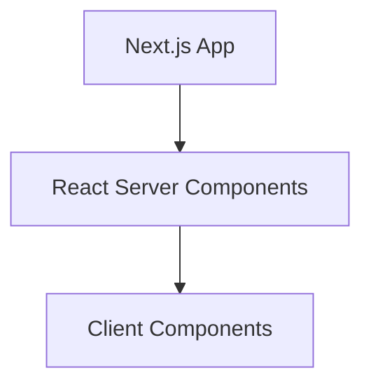

# コンテンツ開発計画

## 📋 概要

Lunacea ポートフォリオサイトに以下のコンテンツを追加する：

1. **Blog機能** - MDX対応の技術ブログ
2. **Contact機能** - SocialLinksにメール連絡先を追加
3. **Profile セクション拡充** - 技術スタック紹介
4. **Works セクション強化** - プロジェクト詳細表示

## 🔧 現在の技術スタック

- **Frontend**: Next.js 15 + React 19 + TypeScript
- **Styling**: Tailwind CSS 4.x
- **Icons**: FontAwesome (brands + solid)
- **3D**: Three.js + React Three Fiber
- **Database**: Drizzle ORM + PostgreSQL
- **Authentication**: Clerk
- **i18n**: next-intl (en/ja対応)

## 📝 1. Blog機能 (優先度: 最高)　だいたいやった

### 機能要件

- **MDX対応**: Markdown + JSX コンポーネント
- **コードブロック**: シンタックスハイライト (主要言語対応)
- **Mermaidダイアグラム**: 図表のきれいなレンダリング
- **目次自動生成**: remark-toc
- **タグ・カテゴリ機能**
- **検索機能** (将来実装)
- **RSS フィード** (将来実装)

### 技術実装

```bash
# 必要なパッケージ
bun add @mdx-js/loader @mdx-js/react @next/mdx
bun add rehype-highlight rehype-slug rehype-autolink-headings
bun add remark-gfm remark-toc
bun add mermaid
bun add gray-matter reading-time
```

### ディレクトリ構造

```
src/app/[locale]/(general)/blog/
├── page.tsx                    # ブログ一覧ページ
├── [slug]/page.tsx             # 個別記事ページ  
├── tag/[tag]/page.tsx          # タグ別記事一覧
└── loading.tsx                 # ローディング状態

src/components/blog/
├── BlogCard.tsx                # ブログカード
├── BlogHeader.tsx              # 記事ヘッダー
├── CodeBlock.tsx               # コードブロック
├── MermaidDiagram.tsx          # Mermaid図表
├── TableOfContents.tsx         # 目次
├── TagList.tsx                 # タグリスト
└── ReadingTime.tsx             # 読了時間

content/blog/
├── 2024-01-01-sample-post.mdx
├── 2024-01-15-next-js-tips.mdx
└── ...

src/lib/
├── mdx.ts                      # MDX処理ロジック
└── blog.ts                     # ブログ関連ユーティリティ
```

### データベース設計

```sql
-- ブログ記事テーブル (将来のCMS化用)
CREATE TABLE blog_posts (
  id SERIAL PRIMARY KEY,
  title VARCHAR(255) NOT NULL,
  slug VARCHAR(255) UNIQUE NOT NULL,
  description TEXT,
  content_path VARCHAR(255) NOT NULL,
  tags TEXT[],
  published_at TIMESTAMP,
  updated_at TIMESTAMP DEFAULT NOW(),
  is_published BOOLEAN DEFAULT false,
  reading_time INTEGER, -- 分単位
  view_count INTEGER DEFAULT 0
);
```

### MDX設定 (next.config.ts)

```typescript
import createMDX from '@next/mdx'
import remarkGfm from 'remark-gfm'
import remarkToc from 'remark-toc'
import rehypeHighlight from 'rehype-highlight'
import rehypeSlug from 'rehype-slug'
import rehypeAutolinkHeadings from 'rehype-autolink-headings'

const withMDX = createMDX({
  extension: /\.mdx?$/,
  options: {
    remarkPlugins: [remarkGfm, remarkToc],
    rehypePlugins: [
      rehypeHighlight,
      rehypeSlug,
      [rehypeAutolinkHeadings, { behavior: 'wrap' }]
    ],
  },
})

export default withMDX(nextConfig)
```

### コンテンツ例

```mdx
---
title: "Next.js 15の新機能解説"
description: "Next.js 15で追加された新機能について詳しく解説します"
tags: ["Next.js", "React", "TypeScript"]
publishedAt: "2024-01-15"
---

# Next.js 15の新機能解説

## 概要
Next.js 15では多くの新機能が追加されました...

```js
// コードブロック例
export default function Page() {
  return <div>Hello Next.js 15!</div>
}
```



```

## 📧 2. Contact機能 (優先度: 高)

### 機能要件
- SocialLinksコンポーネントにEmail追加
- `contact@lunacea.jp` への直接メールリンク
- FontAwesome envelope アイコン使用

### 実装箇所
- `src/components/templates/SocialLinks.tsx` を更新
- `src/lib/fontawesome.ts` にenvelope アイコン追加

### コード変更
```typescript
// src/lib/fontawesome.ts に追加
import { faEnvelope } from '@fortawesome/free-solid-svg-icons';

library.add(
  // ... 既存のアイコン
  faEnvelope,
);

// src/components/templates/SocialLinks.tsx
const socialLinks = [
  // ... 既存のリンク
  {
    'name': 'Email',
    'icon': faEnvelope,
    'url': 'mailto:contact@lunacea.jp',
    'aria-label': 'メールを送信',
  },
];
```

## 🎯 3. Profile セクション拡充 (優先度: 中)

### 機能要件

- 技術スタック可視化 (レーダーチャートまたはスキルバー)
- GitHub API連携 (リポジトリ情報)
- 経験年数とプロジェクト実績
- プロフィール画像とアバター

### 技術実装

```bash
bun add chart.js react-chartjs-2  # チャートライブラリ
bun add @octokit/rest             # GitHub API
```

## 🎨 4. Works セクション強化 (優先度: 中)

### 機能要件

- プロジェクト画像ギャラリー
- 技術スタック別フィルタリング
- デモリンク・GitHubリンク
- プロジェクト詳細ページ強化

### データベース設計

```sql
CREATE TABLE projects (
  id SERIAL PRIMARY KEY,
  title VARCHAR(255) NOT NULL,
  slug VARCHAR(255) UNIQUE NOT NULL,
  description TEXT,
  tech_stack TEXT[],
  github_url VARCHAR(255),
  demo_url VARCHAR(255),
  featured_image VARCHAR(255),
  gallery_images TEXT[],
  status VARCHAR(50), -- 'active', 'completed', 'archived'
  created_at TIMESTAMP DEFAULT NOW(),
  updated_at TIMESTAMP DEFAULT NOW()
);
```

## 🗂️ ロケール設定更新

### 翻訳追加が必要な項目

```json
// src/locales/ja.json & en.json
{
  "Blog": {
    "meta_title": "Blog | Lunacea portfolio",
    "meta_description": "技術ブログ記事一覧",
    "no_posts": "記事がありません",
    "read_more": "続きを読む",
    "reading_time": "{time}分で読了",
    "published_on": "公開日: {date}",
    "tags": "タグ: ",
    "all_posts": "すべての記事",
    "latest_posts": "最新の記事"
  },
  "Contact": {
    "meta_title": "Contact | Lunacea portfolio", 
    "email_label": "メールで連絡",
    "social_links": "SNSリンク"
  }
}
```

## ⏱️ 実装スケジュール

### Phase 1: Blog基盤 (1-2日)

1. MDXセットアップとconfiguration
2. 基本的なblogページ作成
3. コードブロックとmermaid対応
4. サンプル記事作成

### Phase 2: Contact機能 (0.5日)

1. SocialLinksにEmail追加
2. FontAwesome設定更新
3. ロケール設定追加

### Phase 3: Profile拡充 (1-2日)

1. 技術スタック表示コンポーネント
2. GitHub API連携
3. チャート機能実装

### Phase 4: Works強化 (1-2日)

1. プロジェクトデータ構造設計
2. ギャラリー機能実装
3. フィルタリング機能

### Phase 5: 統合・最適化 (1日)

1. パフォーマンス最適化
2. SEO設定
3. テスト・デバッグ

## 📚 参考リンク

- [Next.js MDX](https://nextjs.org/docs/app/building-your-application/configuring/mdx)
- [Mermaid.js](https://mermaid.js.org/)
- [rehype-highlight](https://github.com/rehypejs/rehype-highlight)
- [GitHub REST API](https://docs.github.com/en/rest)

---

**最終更新**: 2024年12月現在
**担当**: Lunacea
**ステータス**: 実装準備完了
