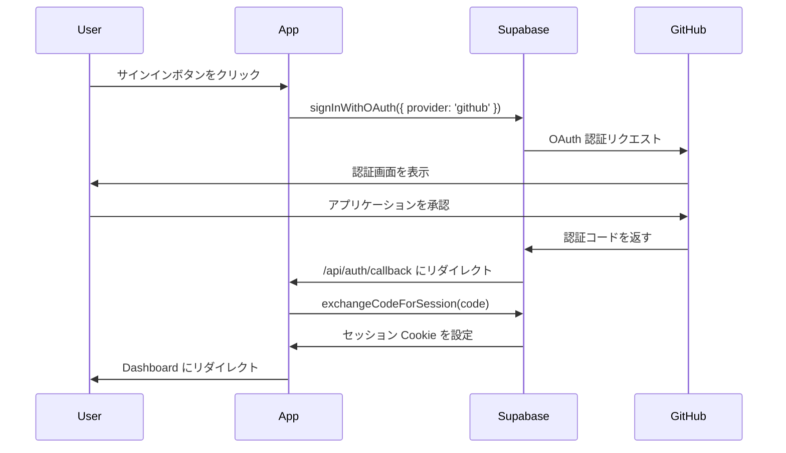

# Supabase Auth セットアップガイド

このドキュメントでは、Supabase Auth を使用した GitHub 認証の設定方法について説明します。

## 📋 目次

1. [Supabase プロジェクトの設定](#supabase-プロジェクトの設定)
2. [GitHub OAuth アプリケーションの作成](#github-oauth-アプリケーションの作成)
3. [環境変数の設定](#環境変数の設定)
4. [認証フローの理解](#認証フローの理解)
5. [トラブルシューティング](#トラブルシューティング)

## Supabase プロジェクトの設定

### 1. Supabase プロジェクトの作成

1. [Supabase](https://supabase.com) にアクセスし、新しいプロジェクトを作成
2. プロジェクト名とデータベースパスワードを設定
3. リージョンを選択（日本の場合は Northeast Asia (Tokyo) を推奨）

### 2. API キーの取得

1. Supabase ダッシュボードで `Settings` → `API` に移動
2. 以下のキーを取得：
   - `Project URL` → `NEXT_PUBLIC_SUPABASE_URL`
   - `anon public` → `NEXT_PUBLIC_SUPABASE_ANON_KEY`
   - `service_role` → `SUPABASE_SERVICE_ROLE_KEY` ⚠️ **絶対に公開しない**

## GitHub OAuth アプリケーションの作成

### 1. GitHub OAuth App の作成

1. GitHub の [Settings] → [Developer settings] → [OAuth Apps] に移動
2. `New OAuth App` をクリック
3. 以下の情報を入力：
   - **Application name**: `Your App Name`
   - **Homepage URL**: `http://localhost:3000` （開発時）
   - **Authorization callback URL**: `https://[YOUR_SUPABASE_PROJECT_REF].supabase.co/auth/v1/callback`

### 2. Client ID と Client Secret の取得

1. OAuth App を作成後、`Client ID` をコピー
2. `Generate a new client secret` をクリックして `Client Secret` を生成・コピー

### 3. Supabase に GitHub プロバイダーを設定

1. Supabase ダッシュボードで `Authentication` → `Providers` に移動
2. `GitHub` を選択
3. GitHub OAuth App の `Client ID` と `Client Secret` を入力
4. `Enabled` をオンにして保存

## 環境変数の設定

### 本番環境

`.env.production` または Vercel/Railway などの環境変数設定に以下を追加：

```bash
# Supabase
NEXT_PUBLIC_SUPABASE_URL=https://xxxxxxxxxxxxx.supabase.co
NEXT_PUBLIC_SUPABASE_ANON_KEY=eyJhbGciOiJIUzI1NiIsInR5cCI6IkpXVCJ9...
SUPABASE_SERVICE_ROLE_KEY=eyJhbGciOiJIUzI1NiIsInR5cCI6IkpXVCJ9...

# App
NEXT_PUBLIC_APP_URL=https://your-domain.com
```

### 開発環境

`.env.local` ファイルを作成：

```bash
# Supabase
NEXT_PUBLIC_SUPABASE_URL=https://xxxxxxxxxxxxx.supabase.co
NEXT_PUBLIC_SUPABASE_ANON_KEY=eyJhbGciOiJIUzI1NiIsInR5cCI6IkpXVCJ9...
SUPABASE_SERVICE_ROLE_KEY=eyJhbGciOiJIUzI1NiIsInR5cCI6IkpXVCJ9...

# App
NEXT_PUBLIC_APP_URL=http://localhost:3000

# 認証をバイパスする場合（テスト用）
# ⚠️ 本番環境では絶対に true にしない
BYPASS_AUTH=false
NEXT_PUBLIC_BYPASS_AUTH=false
```

## 認証フローの理解

### 1. サインインフロー



### 2. 認証チェック

#### サーバーサイド（Server Component）

```typescript
import { auth } from '@/shared/libs/auth-server';

export default async function ProtectedPage() {
  const { userId } = await auth();
  
  if (!userId) {
    redirect('/sign-in');
  }
  
  // 認証済みユーザーのみアクセス可能
}
```

#### クライアントサイド（Client Component）

```typescript
'use client'
import { useAuth } from '@/shared/hooks/useAuth';

export default function ClientComponent() {
  const { user, loading } = useAuth();
  
  if (loading) return <div>Loading...</div>;
  if (!user) return <div>Not authenticated</div>;
  
  // 認証済みユーザーのみ表示
}
```

### 3. Middleware による保護

`src/middleware.ts` で保護されたルートを定義：

```typescript
// /dashboard 配下は認証が必要
const protectedPatterns = [
  /^\/dashboard(\/.+)?$/,
  /^\/[a-z]{2}\/dashboard(\/.+)?$/,
];

// /api/auth/callback は認証不要
const publicPatterns = [
  /^\/api\/auth\/callback$/,
];
```

## トラブルシューティング

### 問題: 認証後に Dashboard にリダイレクトされない

**原因**: 
- callback route のパスが間違っている
- middleware で callback が保護対象になっている
- Cookie が正しく設定されていない

**解決策**:
1. callback route が `/api/auth/callback/route.ts` にあることを確認
2. middleware で `/api/auth/callback` が公開パスとして設定されていることを確認
3. GitHub OAuth App の Authorization callback URL が正しいことを確認

### 問題: `getSession()` が null を返す

**原因**:
- セッション Cookie が設定されていない
- Cookie のドメイン設定が間違っている

**解決策**:
1. ブラウザの開発者ツールで Cookie を確認
2. `sb-*` で始まる Cookie が存在するか確認
3. Supabase の Cookie 設定を確認

### 問題: CORS エラーが発生する

**原因**:
- `NEXT_PUBLIC_APP_URL` が正しく設定されていない
- Supabase の Site URL が間違っている

**解決策**:
1. Supabase ダッシュボードで `Authentication` → `URL Configuration` を確認
2. `Site URL` に正しいドメインを設定（例: `https://your-domain.com`）
3. `Redirect URLs` に callback URL を追加

## セキュリティのベストプラクティス

1. **Service Role Key を絶対に公開しない**
   - クライアントサイドのコードに含めない
   - GitHub に push しない
   - 環境変数として安全に管理

2. **RLS (Row Level Security) を有効化**
   - Supabase のテーブルには必ず RLS を設定
   - 適切なポリシーを定義

3. **認証バイパスは開発時のみ**
   - `BYPASS_AUTH` は本番環境では絶対に `true` にしない
   - できるだけ実際の認証フローでテスト

4. **HTTPS を使用**
   - 本番環境では必ず HTTPS を使用
   - Cookie の Secure フラグが自動的に設定される

## 参考リンク

- [Supabase Auth Documentation](https://supabase.com/docs/guides/auth)
- [Supabase Auth with Next.js](https://supabase.com/docs/guides/auth/server-side/nextjs)
- [@supabase/ssr Documentation](https://supabase.com/docs/guides/auth/server-side-rendering)
